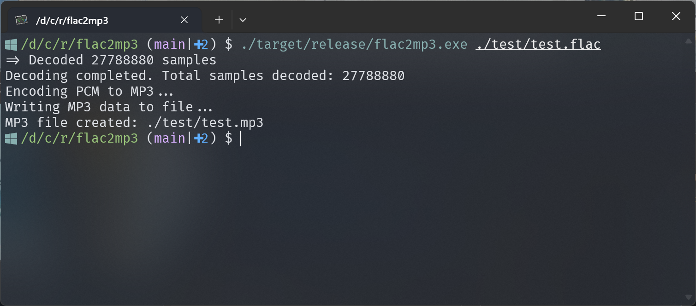

A pure rust-driven application that converts your flac audio files to mp3 format.

## Screenshots



## Installation

1. See [releases](https://github.com/cworld1/flac2mp3/releases) for the latest binaries.
2. Checkout [Actions](https://github.com/cworld1/flac2mp3/actions/workflows/draft.yml) to see the latest builds.

## Usage

```shell
flac2mp3 <flac-file-path>
```

## Local Development

```shell
git clone https://github.com/cworld1/flac2mp3.git
cd flac2mp3
cargo run --release
```

## Thanks

- [mp3lame-encoder](https://github.com/DoumanAsh/mp3lame-encoder)
- [mp3lame-sys](https://crates.io/crates/mp3lame-sys)
- [Symphonia](https://github.com/pdeljanov/Symphonia)

## License

This project is licensed under the GPL 3.0 License.
